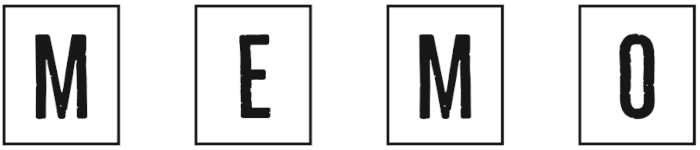
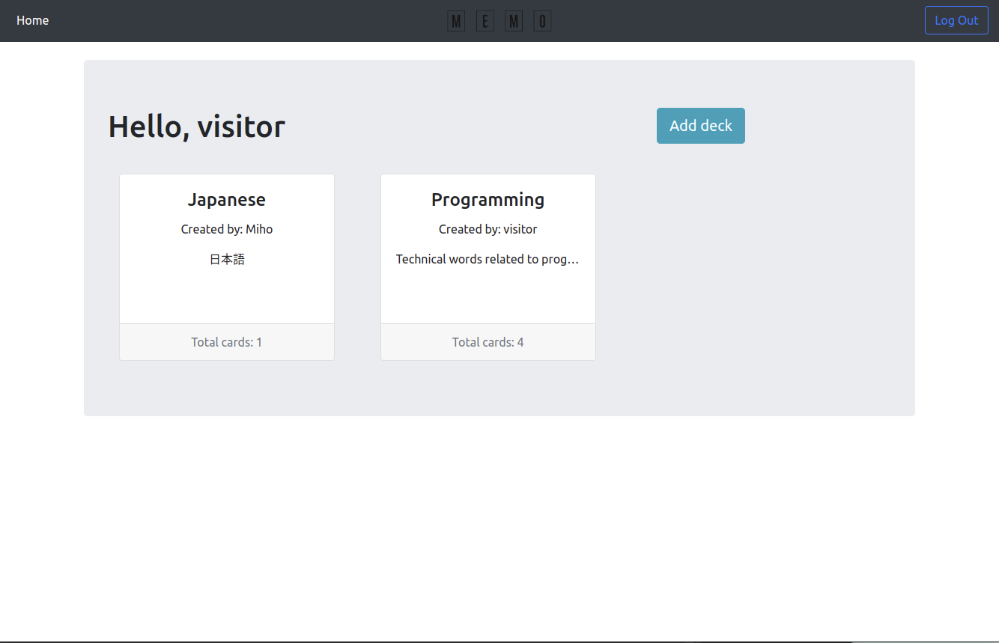
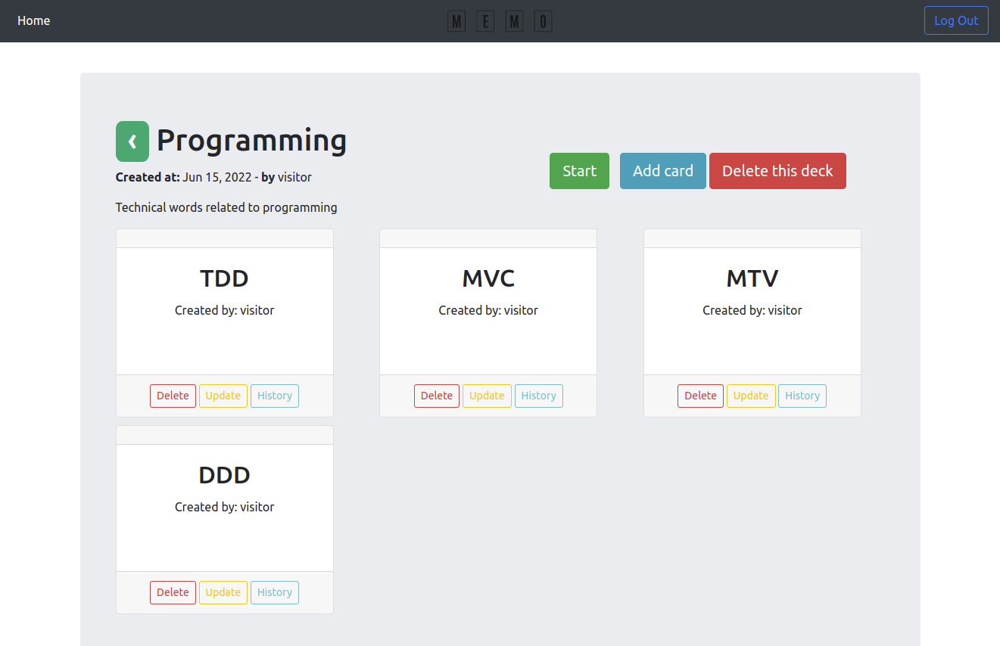
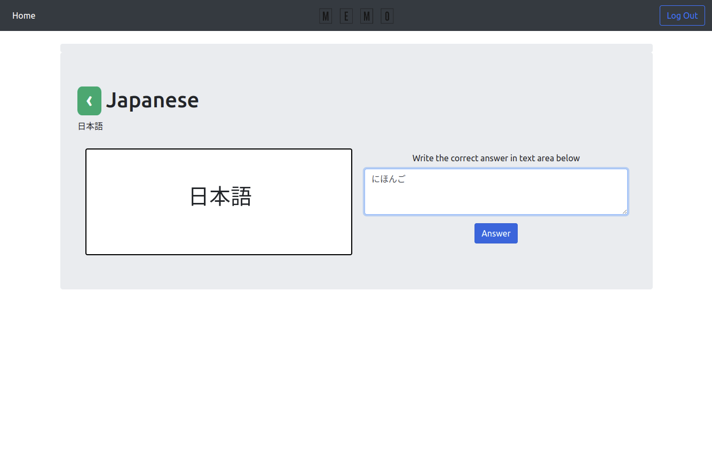
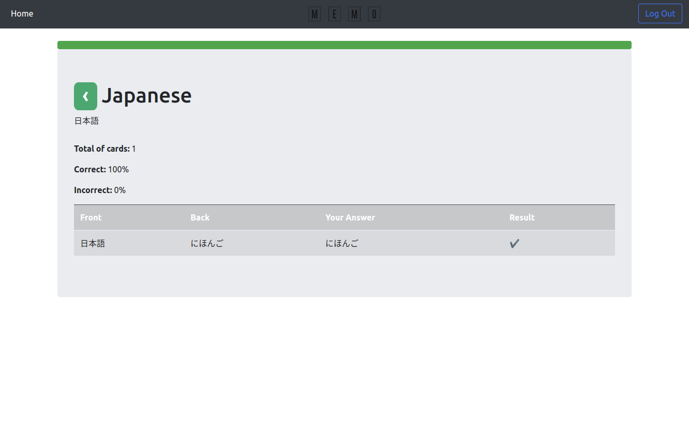

# Memo Django
<p align="center">
<a href="https://memo-memo.herokuapp.com/" target="_blank"></a>
</p>


<p >
<details open="open">
  <summary>Table of Contents</summary>
  <ol>
    <li>
      <a href="#about-the-memo">About The Memo</a>
      <ul>
        <li><a href="#screenshots">Screenshots</a></li>
        <li><a href="#project-structure">Project Structure</a></li>
      </ul>
    </li>
    <li>
      <a href="#getting-started">Getting Started</a>
        <ul>
        <li><a href="#local-environment">Local Environment</a></li>
      </ul>
    </li>
</details>

## About the memo

Memo is a flashcard-like web application built with Django, Django Rest Framework, jQuery and Bootstrap. You can create your own deck and also create flashcards with about contents you want to learn. The object of this application is to make learning interesting and fun. 

You can check the deployed project [here](https://memo-memo.herokuapp.com/).

Use the login credencial below to access the web application: 
```
  Username: visitor
  Password: v1s1t0r@123
```

### Screenshots

<table>
  <tr>
    <td>
      
    </td>
    <td>
      
    </td>
  </tr>
</table>

<table> 
  <tr>
    <td>
      
    </td>
    <td>
      
    </td>
  </tr>
</table>

### Project Structure

```sh
root ┐
     ├ accounts (login) 
     ├ memo (api) 
     ├ memo_front (app) 
     ├ project (core of memo) 
     ├ static
     ├ templates ┐
     └ ...       ├ frontend
     └ ...       └ registration
```

## Getting Started

Before the setup, make sure you have:

- Python 3.9
- Pip
- Docker compose

#### Clone this repository:

```sh
$ git clone https://github.com/yamawakimiho/memo_django.git
```

Create a virtual environment running **Python 3.9**:

```sh
virtualenv venv -p $(which python3)
```

or

```sh
$ mkvirtualenv -p $(which python3) venv
```

### Activate the virtual environment:

```sh
$ source venv/bin/activate
```

or

```sh
$ workon venv
```

### Update pip
```sh
$ pip install -U pip setuptools wheel pip-tools
```

Install the project requirements:

```sh
$ pip-sync
```

### Local Environment

Make a copy of `.env_example` file and named it to `.env`

Use the command below to build, create and start the docker compose:
```sh
$ docker-compose up
```
Migrate your model: 
```sh
$ python manage.py migrate
```

Run the localhost (make sure docker is up in your localhost!): 

```sh
$ python manage.py runserver
```
